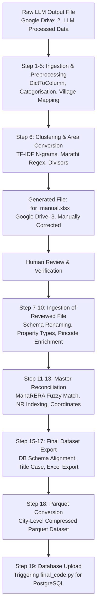

# Maharashtra IGR Processing Pipeline Documentation (`project.py`)

## 1. Executive Summary & Overview

`project.py` is the central orchestrator and data transformation pipeline for processing Maharashtra Inspector General of Registration (IGR) real estate transaction data. It ingests semi-structured LLM-parsed output files, standardizes project names through machine-learning clustering, normalizes Marathi land/area measurements, reconciles with MahaRERA master records, enriches buyer demographics and geospatial coordinates, and formats the data for PostgreSQL ingestion.

---

## 2. Pipeline Execution Modes

When launching `project.py`, the user selects the **Target City** (e.g., Mumbai, Pune, Thane) and one of three execution modes:

```
[1] Run from START (Step 1 to Step 19)
    - Full end-to-end execution starting with raw LLM outputs.
[2] Run from STEP 7 (Load manually corrected file directly, Steps 7 to 19)
    - Resumes pipeline after human review of project names and areas.
[3] Run STEP 18 ONLY (Parquet Conversion directly)
    - Fast-path for converting verified Excel datasets to Parquet and triggering DB upload.
```

---

## 3. High-Level Architecture Flow



---

## 4. End-to-End Step-by-Step Breakdown

### Pre-Step: Target City Selection & Environment Configuration
- **City Registry (`city_config.py`)**: Interactively selects city (Mumbai [ID: 8], Pune [ID: 9], Thane [ID: 12], etc.).
- **Dynamic Drive Binding**: Resolves local Google Drive shortcut paths on `G:\.shortcut-targets-by-id` for:
  - Input Folder (`2. LLM Processed Data`)
  - Manual Review Folder (`3. Manually Corrected`)
  - Final Output Folder (`4. Final processed file`)
- **Divisor Loading (`divisor.py`)**: Sets city-specific Saleable-to-Carpet divisors (e.g., Mumbai: `1.45`, Pune: `1.35`).

---

### Step 1: Input File Selection (Location-Wise Drive Browser)
- **Function**: `get_file_from_drive(...)`
- **Source**: `G:\.shortcut-targets-by-id\<input_id>\2. LLM Processed Data\`
- **Mechanism**:
  - Recursively scans the input folder on Google Drive.
  - Groups files by locality subfolders (e.g., Andheri, Kothrud, Wakad).
  - Displays an interactive menu of locations and file counts.
  - Automatically captures `selected_location` for downstream folder structuring.

---

### Step 2: DictToColumn Parsing
- **Module**: `DictToColumn.py` (`process_dict_to_column`)
- **Purpose**: Raw IGR files contain nested dictionary / JSON string representations inside text columns.
- **Transformation**:
  - Parses stringified dictionaries and extracts individual key-value pairs into first-class DataFrame columns.
  - Resolves target city metadata (`target_city_id`, `target_city_name`).

---

### Step 3: Create `final_project_name`
- **Purpose**: Establish a standardized project name column before entity resolution.
- **Logic**:
  - Checks if `project_name_en` is populated.
  - If blank or empty string, falls back to `building_name_en`.
  - Flags provenance in `final_project_name_status`:
    - `"Project Name Considered"`
    - `"Building Name Considered"`

---

### Step 4: Static Dictionary Mapping
- **Module**: `static.py` (`result_dict`, `word_number_dict`)
- **Purpose**: Maps Marathi registration deed names (`docname`) to standardized English transaction descriptions.
- **Logic**:
  - Transforms Marathi deed labels (e.g., खरेदीखत, भाडेपट्टा, बक्षीसपत्र, गहाणखत) into standardized English transaction types (`Sale Deed`, `Lease Deed`, `Gift Deed`, `Mortgage Deed`).

---

### Step 5: Transaction Categorisation
- **Module**: `transaction_categorizer.py` (`categorise`)
- **Purpose**: Group granular transaction types into primary analytical buckets:
  - **`Sale`**: Outright purchases, conveyances, developer-buyer sales.
  - **`Lease / Mortgage`**: Rental agreements, leave & license, mortgage deeds.
  - **`Other`**: Gift deeds, release deeds, conveyances, power of attorney.

---

### Step 5.5: Marathi Village to Location Mapping
- **Function**: `populate_village_mapping(...)`
- **Purpose**: Resolves localized Marathi revenue village names (`village_name_marathi` / `areaname`) against the PostgreSQL database.
- **Mechanism**:
  - Queries `SELECT DISTINCT village_name_marathi, location_name, registered_document_village_name FROM public.transactions WHERE city_id = %s`.
  - Populates standardized `location_name` and `registered_document_village_name`.

---

### Step 6: Project Standardization & Area Conversion (`_for_manual.xlsx`)
- **Module**: `project_name_Std_and_area_conversion.py` (`process_dataframe`)
- **Architecture**:
  1. **Part A - Hybrid Entity Resolution**:
     - Strips legal suffixes (CHS, Phase, Wing, Coop Hsg Soc).
     - Computes character n-gram TF-IDF embeddings and cosine nearest neighbors.
     - Performs pairwise candidate validation (rejecting unsafe matches across phases or differing numerical identifiers).
     - Greedy clustering with cluster summary metrics.
  2. **Part B - Marathi Area Unit Parsing & Conversion**:
     - Extracts complex Marathi area expressions (Hectare-Are-Sq.m, Guntha, Are, Sq.ft, Sq.m).
     - Converts all parsed measurements into normalized **Square Metres**.
  3. **Part C - Unit and Floor Processing**:
     - RegEx extraction of flat/shop numbers (`unit_number`) and floor numbers (`floor_number`).
  4. **Part D - Net Carpet Area Derivation**:
     - For Sale records with only saleable or buildup area, applies the configured city divisor (`1.45` for Mumbai, `1.35` for Pune) to derive `net_carpet_area_sq_m`.
  5. **Export Multi-Sheet Workbook**:
     - Creates `<Location>_for_manual.xlsx` with review tabs (`Combined`, `Cluster Summary`, `Manual Review`, `Unrecognized Areas`).
     - Saves directly to Google Drive: `3. Manually Corrected/<Location>/`.
  6. **Automated Notification (Optional)**:
     - Prompts user to dispatch an automated email via SMTP with review guidelines, deadline banner, and attachment or Google Drive link to colleagues.

---

### Step 7: Load Manually Corrected File
- **Function**: `get_manual_corrected_file(...)`
- **Purpose**: Pipeline pauses for user review. Once manual corrections to project names and areas are finished, this step loads the reviewed file.
- **Mechanism**:
  - Displays available folders and files in `3. Manually Corrected`.
  - Pressing `Enter` automatically accepts the file generated in Step 6.
  - Supports direct path input.

---

### Step 8: Standardize Schema & Rename Columns
- **Function**: `rename_columns(...)`
- **Mapping**:
  | Raw Column | Standard Database Column |
  | :--- | :--- |
  | `docno` | `document_number` |
  | `consideration_amt` | `agreement_price` |
  | `marketvalue` | `guideline_value` |
  | `Bhumapan` | `property_description` |
  | `registrationdate` | `transaction_date` |
  | `sellerparty` | `seller_name` |
  | `purchaserparty` | `buyer_name` |
  | `property_type` | `property_type_raw` |
  | `dateofexecution` | `date_of_agreement_execution` |
  | `micrno` | `micr_number` |
  | `stampdutypaid` | `stamp_duty_paid` |
  | `registrationfees` | `registration_fee` |
  | `flat_number` | `unit_number` |
  | `areaname` | `village_name_marathi` |
  | `srocode` | `sub_registrar_office_code` |

---

### Step 9: Categorise Property Type
- **Function**: `_map_property_type(val)`
- **Standardized Categories**:
  - **`Flat`**: Apartment, Flat, Flat/Shop, House, Residential, Room.
  - **`Office`**: Commercial Property, Office, Commercial Wing.
  - **`Shop`**: Commercial Shop, Restaurant/Bar, Shop, Shop/Office.
  - **`Villa`**: Bungalow, Row House, Villa.
  - **`Plot`**: Land, Open Land, Plot.
  - **`Others`**: Unmapped or composite types.

---

### Step 10: Buyer Location & Pincode Enrichment
- **Function**: `add_buyer_location(df, postal_csv_path)`
- **Mechanism**:
  - Extracts 6-digit Indian postal PIN codes from `buyer_name` (e.g., `400053`).
  - Merges against `postal_pincode.csv` (`Pincode`, `OfficeName_P`, `District_P`, `StateName_P`).
  - Enriches `buyer_locality`, `buyer_district`, and `buyer_state`.

---

### Step 11: MahaRERA Master Dataset Matching
- **Module**: `rera_matching.py` (`process_rera_matching`)
- **Dataset**: City-specific RERA master file (e.g., `mumbai RERA GRAND EXCEL VERSION.xlsx`, `Pune RERA GRAND EXCEL VERSION 9.xlsx`).
- **Enrichment Fields**:
  - `index`: Unique MahaRERA project identifier.
  - `modified_project_name`: Verified MahaRERA project title.
  - `project_latitude` & `project_longitude`: Verified project coordinates.
  - `unit_configuration` / `BHK`: 1 BHK, 2 BHK, 3 BHK, etc.
  - `rera_location`: Official registered location.

---

### Intermediate Schema Alignment & Rate Derivation
Before index assignment, `project.py` executes critical financial and chronological derivations:
1. **Quarter Derivation**: Formats `Q1-2026`, `Q2-2026`, etc., from `transaction_date`.
2. **Date Reformatting**: Standardizes dates to `DD/MM/YYYY`.
3. **Net Carpet Area in Sq.Ft**: `net_carpet_area_sqft = net_carpet_area_sq_m * 10.7639`.
4. **Calculated Rate (`rate`)**:
   $$\text{rate} = \frac{\text{agreement\_price}}{\text{net\_carpet\_area\_sqft}}$$
   Standardized to PostgreSQL schema column `rate`.
5. **Database Default Assignments**: Populates defaults for `state_name` ("Maharashtra"), `country_name` ("India"), `data_source` ("Igr"), `source_accessibility` ("Easy"), `is_llm_processed` ("Yes"), etc.

---

### Step 12: Assign Non-RERA (NR) Indexes via PostgreSQL
- **Function**: `assign_nr_indexes(...)`
- **Purpose**: Transactions that did not match any MahaRERA project still require a unique project-level tracking ID.
- **Mechanism**:
  - Connects to PostgreSQL:
    ```sql
    SELECT MAX((regexp_match(internal_index_id, '^nr(\d+)', 'i'))[1]::int)
    FROM public.transactions
    WHERE city_id = %s AND internal_index_id ~* '^nr\d+';
    ```
  - Identifies highest existing NR number for the city (e.g., `nr18420`).
  - Sequentially assigns new NR IDs (`nr18421`, `nr18422`, ...) to eligible unindexed projects.

---

### Step 13: Fetch Location Coordinates from Database
- **Function**: `populate_location_coords(...)`
- **Purpose**: Ensures every record has regional geospatial fallback coordinates even if specific project coordinates are missing.
- **Mechanism**:
  - Reads coordinates from `public.dim_location` (`location_latitude`, `location_longitude`) matching on `location_name`.

---

### Step 14: Project Coordinates via Google Places API (Toggleable)
- **Module**: `project_coordinates.py`
- **Status**: Optional / commented out in standard runs to conserve API credits.

---

### Step 15: Filter & Order Selective Database Columns
- **Module**: `db_columns.py` (`DB_SEQUENCE`)
- **Function**: `keep_db_columns(df, DB_SEQUENCE)`
- **Purpose**: Strict schema conformity. Reorders and filters the DataFrame so that column order exactly mirrors `public.transactions` in PostgreSQL.

---

### Step 16: Title Case Normalization
- **Purpose**: Cosmetic consistency across text fields.
- **Logic**: Applies Python `.title()` across all object/string columns.

---

### Step 17: Final Output Save (Google Drive & Local Backup)
- **Naming Pattern**: `<Location>_final_processed.xlsx`
- **Target Folder**: `G:\.shortcut-targets-by-id\<final_drive_id>\4. Final processed file\<Location>\`
- **Verification**: Allows interactive path confirmation, filename customization, and validates directory write permissions.

---

### Step 18: Parquet Conversion
- **Module**: `parquet_conersion.py` (`convert_csv_to_parquet`)
- **Purpose**: Generates high-speed columnar Parquet format optimized for bulk database loading and analytics.
- **Output Target**:
  `G:\.shortcut-targets-by-id\1oGd6xPdp686p0qW-tzZyy5quOpi82hLA\DB1+DB2\converted_feather_parquet\<City>\<City>_db1.parquet`
- **Type Casting**: Validates and serializes dates, numeric prices, and string identifiers.

---

### Step 19: Trigger Database Upload Pipeline (`final_code.py`)
- **Script**: `E:\Nilesh\Database\DB1_DB2_Uploading_Pipeline\final_code.py`
- **Mechanism**:
  - Uses `subprocess.run([sys.executable, "final_code.py"])` in the target virtual environment.
  - Automatically ingests the final Parquet dataset into the PostgreSQL database.

---

## 5. Post-Pipeline: Outlier Detection & Classification

After data ingestion via `final_code.py`, the outlier classification pipeline is executed:

```powershell
# Command
python incremental_outlier_update.py --city-id <CITY_ID>
```

- **Logic**:
  - Compares new transactions against historical baseline medians and interquartile ranges (IQR).
  - Trims top 1% and bottom 1% outliers (P1 / P99).
  - Computes dynamic limits: $\text{lower\_limit} = \frac{\text{median}}{4}$, $\text{upper\_limit} = \text{median} \times 4$.
  - Flags records: `Normal`, `Lower Outlier`, `Upper Outlier`, `Mumbai Low Price Outlier`, `Zero Area/Price`.
  - Updates PostgreSQL columns (`rate`, `is_outlier`, `outlier_type`).
  - Generates multi-sheet Excel summary report in `outlier_summaries/`.

---

## 6. Summary of Key Files & Dependencies

| File | Role |
| :--- | :--- |
| [project.py](file:///e:/Nilesh/IGR_processing_System/Processing/project.py) | Master CLI pipeline orchestrator. |
| [server.py](file:///e:/Nilesh/IGR_processing_System/Processing/server.py) | FastAPI Web Server & real-time SSE progress monitor. |
| [city_config.py](file:///e:/Nilesh/IGR_processing_System/Processing/city_config.py) | Master city registry, Drive IDs, RERA paths, and email templates. |
| [divisor.py](file:///e:/Nilesh/IGR_processing_System/Processing/divisor.py) | City-specific carpet area conversion divisors. |
| [DictToColumn.py](file:///e:/Nilesh/IGR_processing_System/Processing/DictToColumn.py) | JSON/dict string flattener. |
| [transaction_categorizer.py](file:///e:/Nilesh/IGR_processing_System/Processing/transaction_categorizer.py) | Transaction classifier (Sale / Lease / Other). |
| [project_name_Std_and_area_conversion.py](file:///e:/Nilesh/IGR_processing_System/Processing/project_name_Std_and_area_conversion.py) | Machine-learning clustering, Marathi area conversion, review workbook generator. |
| [rera_matching.py](file:///e:/Nilesh/IGR_processing_System/Processing/rera_matching.py) | MahaRERA master dataset matching engine. |
| [postal_pincode.csv](file:///e:/Nilesh/IGR_processing_System/Processing/postal_pincode.csv) | Master Indian postal directory for buyer enrichment. |
| [db_columns.py](file:///e:/Nilesh/IGR_processing_System/Processing/db_columns.py) | Canonical PostgreSQL schema column sequence (`DB_SEQUENCE`). |
| [parquet_conersion.py](file:///e:/Nilesh/IGR_processing_System/Processing/parquet_conersion.py) | Excel-to-Parquet conversion utility. |
| [incremental_outlier_update.py](file:///e:/Nilesh/IGR_processing_System/Processing/incremental_outlier_update.py) | Statistical outlier classification and Excel summary generator. |
